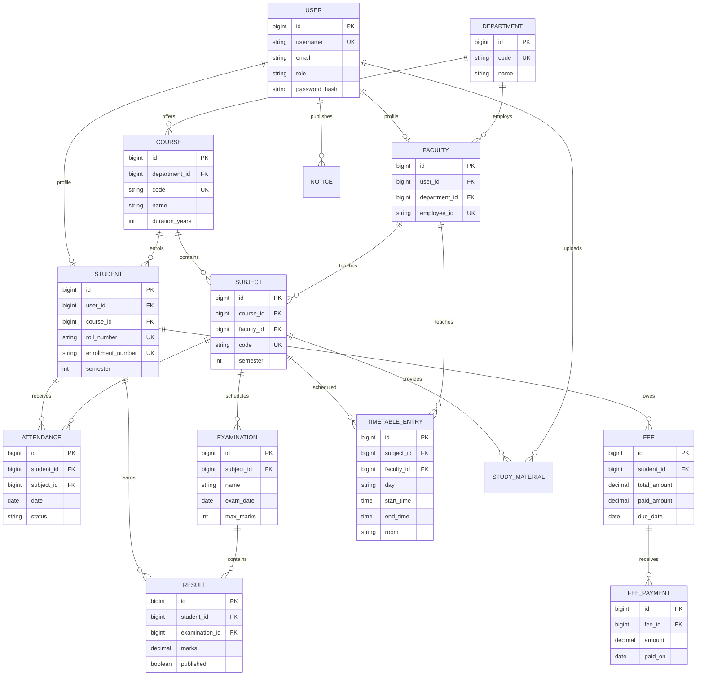

# Entity relationship diagram

```mermaid
erDiagram
  USER ||--o| STUDENT : profile
  USER ||--o| FACULTY : profile
  DEPARTMENT ||--o{ COURSE : offers
  DEPARTMENT ||--o{ FACULTY : employs
  COURSE ||--o{ STUDENT : enrols
  COURSE ||--o{ SUBJECT : contains
  FACULTY ||--o{ SUBJECT : teaches
  STUDENT ||--o{ ATTENDANCE : receives
  SUBJECT ||--o{ ATTENDANCE : records
  SUBJECT ||--o{ EXAMINATION : schedules
  STUDENT ||--o{ RESULT : earns
  EXAMINATION ||--o{ RESULT : contains
  STUDENT ||--o{ FEE : owes
  FEE ||--o{ FEE_PAYMENT : receives
  SUBJECT ||--o{ TIMETABLE_ENTRY : scheduled
  FACULTY ||--o{ TIMETABLE_ENTRY : teaches
  SUBJECT ||--o{ STUDY_MATERIAL : provides
  USER ||--o{ STUDY_MATERIAL : uploads
  USER ||--o{ NOTICE : publishes

  USER {
    bigint id PK
    string username UK
    string email
    string role
    string password_hash
  }
  DEPARTMENT {
    bigint id PK
    string code UK
    string name
  }
  COURSE {
    bigint id PK
    bigint department_id FK
    string code UK
    string name
    int duration_years
  }
  STUDENT {
    bigint id PK
    bigint user_id FK
    bigint course_id FK
    string roll_number UK
    string enrollment_number UK
    int semester
  }
  FACULTY {
    bigint id PK
    bigint user_id FK
    bigint department_id FK
    string employee_id UK
  }
  SUBJECT {
    bigint id PK
    bigint course_id FK
    bigint faculty_id FK
    string code UK
    int semester
  }
  ATTENDANCE {
    bigint id PK
    bigint student_id FK
    bigint subject_id FK
    date date
    string status
  }
  EXAMINATION {
    bigint id PK
    bigint subject_id FK
    string name
    date exam_date
    int max_marks
  }
  RESULT {
    bigint id PK
    bigint student_id FK
    bigint examination_id FK
    decimal marks
    boolean published
  }
  FEE {
    bigint id PK
    bigint student_id FK
    decimal total_amount
    decimal paid_amount
    date due_date
  }
  FEE_PAYMENT {
    bigint id PK
    bigint fee_id FK
    decimal amount
    date paid_on
  }
  TIMETABLE_ENTRY {
    bigint id PK
    bigint subject_id FK
    bigint faculty_id FK
    string day
    time start_time
    time end_time
    string room
  }
```
